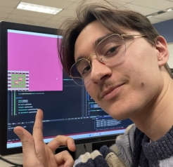

---

# About

{: .align-left}
Hi! My name is Will Gauvin, I'm a games programmer, artist, designer, and writer with over 3 years of specialized education in game development.

I'm a recent graduate of Algonquin College's Game Development program with a specialization in programming.

My game Hot Reload just placed in the top 1% of games the 2025 Game Maker's Toolkit Game Jam! Check it out [here](https://willygauvin.itch.io/hotreload){:target="_blank"}

 
---

# Projects









# Other Skills



<!--- 


-->

